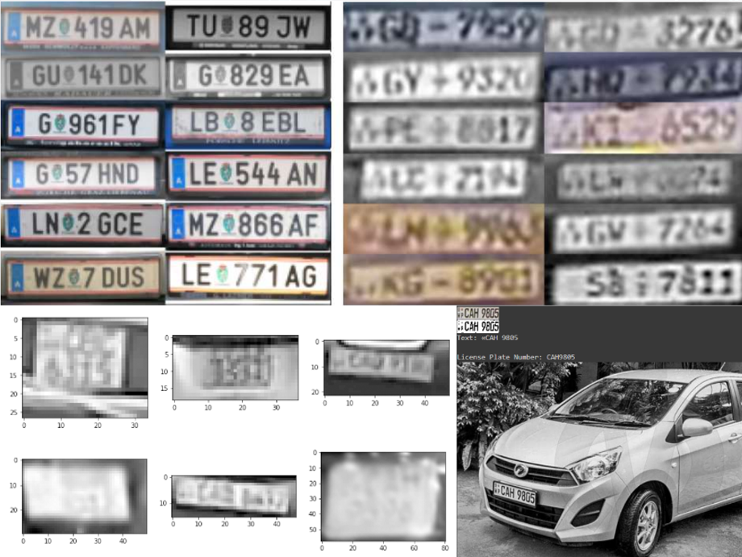
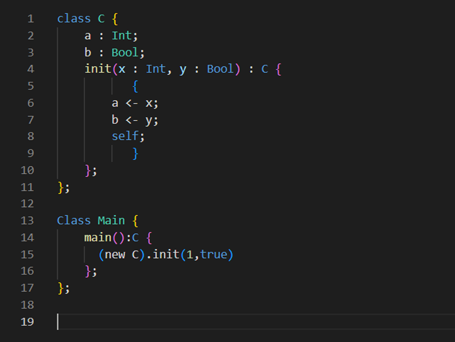
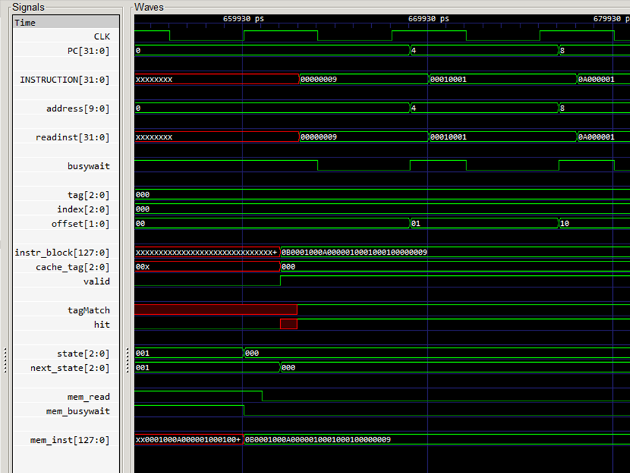
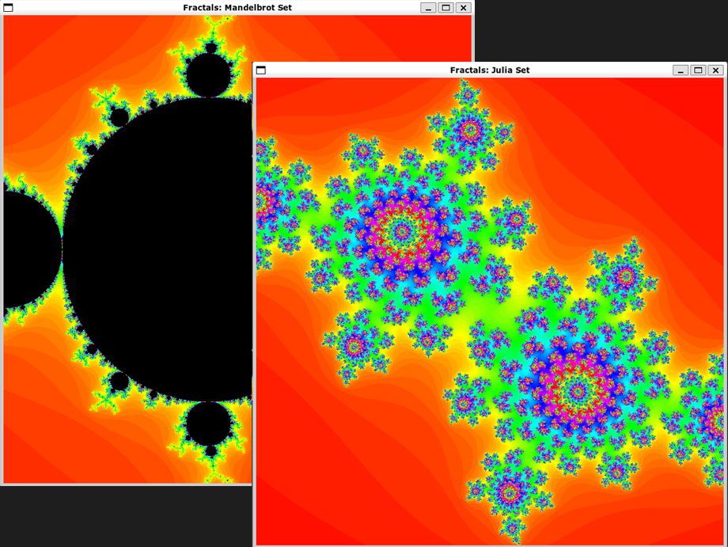

# About Me

I am a third-year Computer Engineering undergraduate at the [Department of Computer Engineering, University of Peradeniya](http://www.ce.pdn.ac.lk) with a strong interest in Computer Architecture and Computer Vision.

 

# Skills and Experience

I am fluent in several programming languages such as **C, Java and Python** and am familiar with languages like **C++ and MATLAB**.

I have a good background in **hardware programming** with experience developing **ARM Assembly** code, programming microcontrollers using **AVR C**, and hardware design using **Verilog-HDL**.

Additionally, I am interested in the fields of **Image Processing** and **Computer Vision**, with hands-on experience in using the **OpenCV** library.

I have also worked as a [Casual Instructor (Teaching Assistant)](https://people.ce.pdn.ac.lk/students/e17/018) at the [Department of Computer Engineering, University of Peradeniya](http://www.ce.pdn.ac.lk) for the following courses.
* CO221 - Digital Design
* CO224 - Computer Architecture
* CO323 - Computer Communication Networks II
* CO325 - Computer and Network Security

 

# Projects

|  | **QuickPark -- E-Parking System** *Imesh Balasuriya, [Ravisha Rupasinghe](https://github.com/RavishaHR), [Sandun Perera](https://github.com/sanduu19)* Jul 2021 -- Present [[website](https://cepdnaclk.github.io/e17-3yp-E-Parking-System)][[repo](https://github.com/cepdnaclk/e17-3yp-E-Parking-System)]  A fully-automated parking system that automatically identifies vehicles, assigns parking spots to them and allows reservation of parking spots for a seamless parking experience. |
|  | **Analytical Software for Next Generation Skim Sequencing Data** *Imesh Balasuriya, [Ravisha Rupasinghe](https://github.com/RavishaHR), [Madhushan Ramalingam](https://github.com/DrMadhushan)* Feb 2022 -- Present [[website](https://cepdnaclk.github.io/e17-co328-Skim-Sequencing-Analysis/)][[repo](https://github.com/cepdnaclk/e17-co328-Skim-Sequencing-Analysis)]  An open-source toolkit that implements the existing ITS, Mitochondria and Chloroplast sequencing pipelines in a single GUI package. |
|  | **Reconstruction of Highly-Degraded License Plate Images** *Imesh Balasuriya, [Akila Karunanayake](https://github.com/Akilax0), [Achintha Harshamal](https://github.com/AchinthaHarshamal)* Feb 2022 -- Apr 2022 [[repo](https://github.com/ImeshBalasuriya/CO543-SL-Number-Plate-Detection)]  Demonstration of the effectiveness of traditional image processing techniques in the reconstruction of low-resolution license plate images obtained from CCTV footage. |
|  | **Compiler for COOL Language** *Imesh Balasuriya, [Ravisha Rupasinghe](https://github.com/RavishaHR)* Jan 2022 -- Apr 2022 [[repo](https://github.com/ImeshBalasuriya/CO521-COOL-Compiler)]  A 4-stage compiler from scratch for the COOL programming language comprising of a lexical analyzer, parser, semantic analyzer, and a code generator that generates MIPS assembly code |
|  | **8-bit Single Cycle Processor** *Imesh Balasuriya, [Achintha Harshamal](https://github.com/AchinthaHarshamal)* Jul 2020 -- Oct 2020 [[repo](https://github.com/ImeshBalasuriya/CO224-Single-Cycle-CPU)]  An 8-bit single cycle processor design with a MIPS-style instruction set including an ALU, a register file and control logic and an associated memory architecture with separate data and instruction memory along with their respective caches. |
|  | **Video-to-ASCII-Art Converter** *Imesh Balasuriya* Nov 2020 -- Dec 2020 [[repo](https://github.com/ImeshBalasuriya/Video-to-ASCII)]  An app that creates animated ASCII art on a POSIX-compatible terminal using a video file as the source. |
|  | **Fractal Generator** *Imesh Balasuriya* Nov 2020 -- Dec 2020  A multi-threaded GUI app that generates the Mandelbrot and Julia sets according to user specifications. |